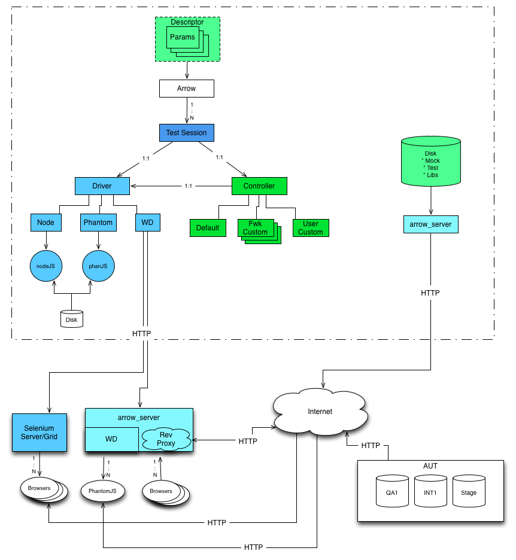

==============
What is Arrow?
==============
Arrow is a test framework designed to promote test-driven JavaScript development. Arrow provides a consistent test creation and execution environment for both developers and quality engineers.

Arrow aims to completely remove the line between development's Unit tests, and QE's functional and integration tests, by providing a uniform way to create and execute both.

Arrow itself, is a thin, extensible layer that marries JavaScript, NodeJS, PhantomJS and Selenium. Arrow allows you to write tests using YUI-Test and execute those tests using NodeJS, PhantomJS or Selenium. Additionally, Arrow provides a rich mechanism for building, organizing and executing tests and test scenarios.

Why Use Arrow
-------------

Arrow's design is based on the idea that test purpose should not dictate how tests are created or executed. Using Arrow, users can create **Unit** tests to validate specific units of JavaScript code, create pre-commit **Functional** tests against a mock page, reuse those tests in post-commit scenarios, while also creating cross-page test scenarios that exercise **Integration**.

What can I do with Arrow?
-------------------------

The answer is simple, anything you can do with JS and NodeJS or Selenium, you can do with Arrow. In addition to unit, functional and integration tests, you can also test web services using NodeJS.

Arrow Internals
---------------

Arrow's architecture is very simple. It is made up of 5 main components.

Core components:

* Test Session: Provides the mechanism for injecting tests onto a page.
* Driver: In Arrow's terminology, this is what determines the driver of your tests. Which mechanism do you want injecting your tests. NodeJS, PhantomJS and Selenium are fully supported.
* Arrow Server: Arrow sever provides two very important functionalities. First, it's a simple file server used to **serve** local mock pages when executing your tests using Selenium. Second, it is a reverse-proxy with a Web Driver implementation. This is used as a way to execute tests against browsers and devices not supported by Selenium. With Arrow Server running, **ANY** device can **register** itself with a given instance of Arrow Server, and that device can then be used as a test executor.

User-facing Components:

* Controllers: If drivers allow you to dictate *where* to execute your tests, controllers, or scenario atoms allow you to dictate *when* to execute your tests. Arrow's default controller or scenario atom opens the page and executes the test. This works well for a large number of tests. However, if you require more complex scenario or more granular control, you can **easily** create your **own** controllers and **control** how and when your tests are executed.
* Libs: Libs, or dependencies, are a way to include any necessary dependencies needed by your test. These can be things such as libraries you've created, the source code against which you are testing etc.

